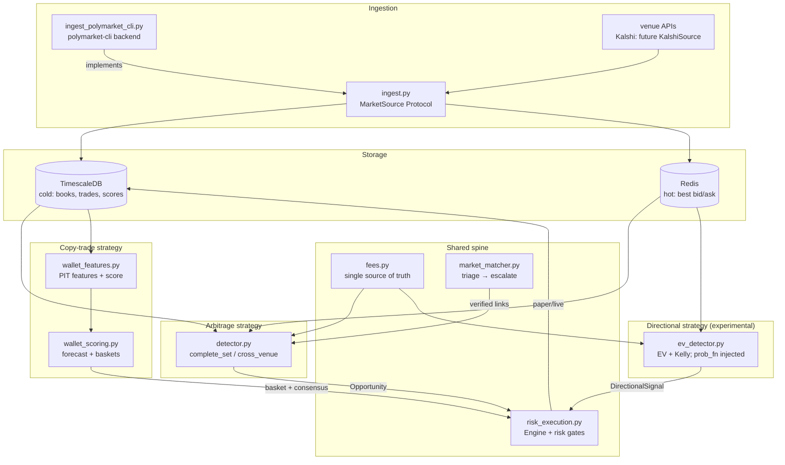

# Architecture Overview (stub)

> **Status: stub.** Derived from reading the existing code, schema,
> [`CONTEXT.md`](../../CONTEXT.md), and [ADRs](./decisions/) — not a full architect
> pass. It reflects the system *as it stands* plus the glossary/ADR decisions.
> The dev-team architect should own and expand this (esp. WP-3's open question
> and any live-mode design) rather than treat it as settled.

## What fairline is

A research stack for finding fee-aware, risk-gated edge in prediction markets via
two **co-equal, independent** strategies that share one spine:

- **Arbitrage** — buy a complete set of outcomes for < $1 (within-venue, or
  cross-venue via a verified link).
- **Copy-trade** — score wallets point-in-time, copy baskets of specialists on
  consensus.

Plus one **experimental** third strategy (ADR-0005): **directional EV** — back
one side when an injected probability model disagrees with the price. Paper-only
until it earns co-equal status.

Everything runs on paper until an edge is proven; live placement is stubbed and
gated (ADR-0001).

## Components & data flow

**Responsibilities**
- `ingest.py` — the `MarketSource` Protocol: markets, orderbooks, price
  history, wallet trades, leaderboard discovery. Row types shaped for the
  schema tables (ADR-0006).
- `ingest_polymarket_cli.py` — first `MarketSource` backend: subprocess over
  the official `polymarket -o json` CLI, no-auth public data only.
- `fees.py` — venue fee math; imported by everything that prices a leg. Single
  source of truth (Polymarket V2 taker `rate·p·(1−p)`, Kalshi per-order rounded).
- `detector.py` — fee-aware edge for `complete_set` / `cross_venue`; depth-aware
  sizing that walks the book to the profit-*maximizing* size after slippage.
- `market_matcher.py` — cross-venue outcome equivalence. Embeddings **triage**;
  the LLM (or a human) **writes** the link (ADR-0002).
- `wallet_features.py` — point-in-time, leakage-safe features + the transparent
  0–100 composite **score** (ADR-0003).
- `wallet_scoring.py` — forward-labelled XGBoost **forecast** + category baskets;
  adopted only if it beats the composite baseline out-of-time.
- `ev_detector.py` — **experimental** directional strategy (ADR-0005): post-fee
  EV per share, depth-aware sizing, fractional-Kelly cap; probability model
  injected via `prob_fn`, never built here.
- `risk_execution.py` — the one `Engine`: risk gates, paper fills, atomic
  all-legs-or-none arbs, basket-consensus copies, latching kill switch (live).

## Stack

| Choice | Why |
|--------|-----|
| PostgreSQL + TimescaleDB | hypertables for replayable cold time-series (books, trades, scores) |
| Redis | hot best-bid/ask state kept out of the write path |
| pandas / numpy / scipy | point-in-time feature engineering + rank stats |
| XGBoost | the forecast model; earns its place only vs. the composite baseline |
| Ollama (local) + Claude API | local/remote split for matching — cheap triage local, hard judgments remote |
| polymarket-cli (Rust binary) | first MarketSource backend — official, no-auth public data, absorbs API churn (ADR-0006) |
| py-clob-client / Kalshi REST | live placement (intentionally unimplemented) |

## Data model

Full DDL: [`schema/001_schema.sql`](../../schema/001_schema.sql). Grain and
relationships (see CONTEXT.md for canonical definitions):

- **venue** (`polymarket`|`kalshi`) → **market** (one event, one venue) →
  **outcome** (one row per tradable leg; prices/books/links attach here).
- **market_link** — pairwise outcome equivalence with `polarity` + `confidence`
  (ADR-0004: a link, not a canonical event entity).
- **orderbook_snapshot**, **trade_print** — hypertables (cold time-series).
- **wallet** → **wallet_trade** (resolved positions) → **wallet_score**
  (point-in-time hypertable).
- **arb_opportunity** → **execution** (detection + execution audit trail).

## Interface contracts (as-built)

- `Leg(venue, size, price, category, ...).fee()` — the pricing primitive.
- `detector` edge fns return an `Opportunity(kind, size, gross_edge, total_fees,
  net_profit, roi, legs)`; `net_edge` is a derived property (per $1 payout).
- `Engine.execute_arb(opp)` — atomic all-legs-or-none; partial → `aborted` +
  unwind. `Engine.execute_copy(wallet, leg, basket_agreement)` — consensus-gated.
- `match(q_a, rules_a, q_b, rules_b, *, embedder, confirmer) -> MatchResult|None`
  — injectable models for testing.

## Cross-cutting policy (current state — thin, needs the architect)

- **Error handling:** unimplemented live/integration paths raise
  `NotImplementedError` on purpose (fail loud, never silently no-op).
- **Config:** risk limits are a `RiskLimits` dataclass; venue fee coefficients
  are module constants in `fees.py`.
- **Testing:** each module is importable and self-demos via `__main__` on
  synthetic data; matcher routing is tested with injected fakes. A `tests/`
  directory now exists (`tests/test_risk_execution_consensus.py`, added during
  WP-4 QA) — standalone, no pytest dependency, matching the repo's
  `python3 <file>.py` convention. **Gap:** only one module has dedicated
  regression tests so far; extending this harness to the rest of the WPs is
  still a candidate v0.2 item.
- **Logging / observability:** not yet designed.
